# Architecture Diagram

```mermaid
flowchart TD
    %% ── Styles ─────────────────────────────────────────────────────────────
    classDef ext      fill:#e8f4f8,stroke:#4a9eca,color:#1a1a1a
    classDef obj      fill:#fff9e6,stroke:#d4a017,color:#1a1a1a,font-weight:bold
    classDef fn       fill:#f0f7ee,stroke:#4caf50,color:#1a1a1a
    classDef policy   fill:#f5eef8,stroke:#9b59b6,color:#1a1a1a
    classDef artifact fill:#fdebd0,stroke:#e67e22,color:#1a1a1a,font-weight:bold

    %% ── External Sources ────────────────────────────────────────────────────
    subgraph SOURCES["☁ External Sources"]
        direction LR
        SRC_PDBe["PDBe / PDB\nArchive"]
        SRC_UniProt["UniProt"]
        SRC_SIFTS["SIFTS"]
        SRC_Taxon["Taxonomy DB"]
    end

    %% ── Raw Input ───────────────────────────────────────────────────────────
    RAW["Raw mmCIF\n(single entry or batch)"]

    %% ═══════════════════════════════════════════════════════════════════════
    %% Component 01 — Ingestion
    %% ═══════════════════════════════════════════════════════════════════════
    subgraph C01["📥  01 · mmCIF Ingestion Layer"]
        direction TB
        F_fetch["fetch_mmCIF()\nRetrieve raw content\nfrom PDBe / PDB / local / cache"]
        F_parse["parse_mmCIF()\nBuild structural hierarchy\natoms → residues → chains\n→ entities → assemblies"]
        F_val01["validate_mmCIF()\nReport consistency\n& completeness issues"]
        F_ingest["ingest_mmCIF()\n[orchestrator]\n— single entry —"]
        F_ingest_many["ingest_list_mmCIF()\n[batch orchestrator]\nsequential | parallel"]
        F_fetch --> F_parse --> F_val01 --> F_ingest
    end

    OBJ01["MmCIFIngestionResult\n───────────────────────\natoms · residues · chains\nentities · assemblies · ligands\nstatus · diagnostics · provenance"]

    %% ═══════════════════════════════════════════════════════════════════════
    %% Component 02 — Canonicalization
    %% ═══════════════════════════════════════════════════════════════════════
    subgraph C02["🔧  02 · Canonical Structure Object Layer"]
        direction TB
        POL02["CanonicalizationPolicy\n───────────────────────\nidentifier_rules\n  chain_id · residue_numbering · assembly_id\nmissing_data_rules\n  missing_atoms · missing_residues · incomplete_chains\naltloc_rules   ·   assembly_rules\nentity_rules   ·   ligand_rules\nvalidation_rules · provenance_rules"]
        F_canon["canonicalize_structure()\nNormalize identifiers · resolve altlocs\nhandle missing data · normalize assemblies\nrecord mappings to original archive"]
        F_val02["validate_canonical_structure()\nCheck structural & mapping consistency"]
        F_canon_many["canonicalize_many_structures()\n[batch orchestrator]"]
        POL02 --> F_canon
        F_canon --> F_val02
    end

    OBJ02["CanonicalStructureResult\n───────────────────────\ncanonical_structure\ncanonical_mappings\n  chain_id · residue_number\n  assembly · entity · altloc\napplied_policy · provenance"]

    %% ═══════════════════════════════════════════════════════════════════════
    %% Component 03 — Metadata & Annotation
    %% ═══════════════════════════════════════════════════════════════════════
    subgraph C03["🏷  03 · Metadata Integration & Derived Annotation Layer"]
        direction TB
        POL03["MetadataIntegrationPolicy\n───────────────────────\ninclude_sources: PDBe · SIFTS · UniProt · Taxonomy\ninclude_categories:\n  archive_metadata · biological_mappings\n  structural_annotations · provenance_metadata\nretrieval_rules · provenance_rules"]
        POL03B["AnnotationPluginPolicy\n───────────────────────\nexecution_rules: sequential | parallel\nfail_on_plugin_error\nprovenance_rules"]
        F_retmeta["retrieve_metadata()\nSource-aware, policy-driven\nretrieval from PDBe, SIFTS,\nUniProt, Taxonomy"]
        F_valmeta["validate_metadata()"]
        F_attmeta["attach_metadata()\nAttach as separate layer —\ndoes NOT modify canonical structure"]
        F_regplugin["register_annotation_plugin()"]
        F_applyplugin["apply_annotation_plugins()\nsequential | parallel"]
        PLUGINS["Built-in & User Plugins\n───────────────────────\nprotein-protein interfaces\nresidue contact maps\nligand-binding sites · pockets\nsecondary structure\nsurface exposure · domains\ncustom research annotations"]
        POL03 --> F_retmeta
        F_retmeta --> F_valmeta --> F_attmeta
        POL03B --> F_applyplugin
        PLUGINS --> F_applyplugin
    end

    OBJ03A["MetadataAnnotatedStructure\n───────────────────────\ncanonical_structure_result\nmetadata_annotations\n  archive_metadata · biological_mappings\n  structural_annotations · provenance_metadata\napplied_metadata_policy · provenance"]

    OBJ03B["AnnotatedStructureWithPlugins\n───────────────────────\n+ derived_annotations\n  [ layer per plugin ]\napplied_plugins · annotation_history"]

    %% ═══════════════════════════════════════════════════════════════════════
    %% Component 04 — Curation
    %% ═══════════════════════════════════════════════════════════════════════
    subgraph C04["🗃  04 · Dataset Construction & Curation Layer"]
        direction TB
        POL04["DatasetCurationPolicy\n───────────────────────\nselection_rules\n  include/exclude sources · biomolecules · methods\nquality_rules\n  max_resolution · min_chain_length · completeness\ncontent_rules  (ligands · waters · ions)\norganism_rules (include/exclude taxa)\ndeduplication_rules\n  strategy: exact_hash | entry_id\nextraction_rules\n  chain · interface · residue sub-policies\nprovenance_rules"]
        F_build["build_dataset()\n[main orchestrator]\nApply policy → select → filter\n→ deduplicate → Dataset (structure-level)"]
        F_filter["filter_dataset()\nResolution · organism · method\ncompleteness · ligand filters"]
        F_dedup["deduplicate_dataset()\nExact deduplication (hash | entry_id)"]
        F_val04["validate_dataset()\nPolicy compliance · integrity"]
        F_extract_chains["extract_chain_records()\nDataset → ChainDataset\none ChainRecord per polymer chain\n(sequence · residues · coordinates)"]
        F_extract_ifaces["extract_interface_records()\nDataset → InterfaceDataset\none InterfaceRecord per chain pair\n(partner details · interface residues)"]
        F_extract_residues["extract_residue_records()\nChainDataset | InterfaceDataset\n→ ResidueDataset"]
        F_build_many["build_dataset_many()\n[batch orchestrator]"]
        POL04 --> F_build
        F_build --> F_filter --> F_dedup --> F_val04
        F_val04 -.->|"optional"| F_extract_chains
        F_val04 -.->|"optional"| F_extract_ifaces
        F_extract_chains -.->|"optional"| F_extract_residues
        F_extract_ifaces -.->|"optional"| F_extract_residues
    end

    OBJ04["PandoraDataset\n(Dataset | ChainDataset | InterfaceDataset | ResidueDataset)\n───────────────────────\ngranularity: structure | chain | interface | residue\ndataset_id · dataset_version\napplied_policy · provenance\nselection_summary · excluded_items\ndeduplication_report"]

    %% ═══════════════════════════════════════════════════════════════════════
    %% Component 05 — Leakage-Safe Splitting
    %% ═══════════════════════════════════════════════════════════════════════
    subgraph C05["✂️  05 · Similarity Analysis & Leakage-Safe Splitting Layer"]
        direction TB
        POL05["LeakagePolicy\n───────────────────────\nsimilarity_rules\n  sequence_similarity: enabled · engine · threshold\n    (structure & chain granularity)\n  structure_similarity: enabled · engine · threshold\n    (all granularities)\nclustering_rules\n  strategy: connected_components | single_linkage\npartition_rules\n  train/val/test fractions · stratify_by_cluster\nleakage_rules\n  forbid_cross_split_similarity\n  enforce_cluster_isolation\nprovenance_rules"]
        EXT05A["MMseqs2\n(sequence similarity engine)"]
        EXT05B["Foldseek\n(structure similarity engine)"]
        F_simrel["compute_similarity_relationships()\nDelegate to external engines\nnormalize outputs → SimilarityRelationship\nItem identifiers are granularity-dependent:\n  structure: entry_id\n  chain: entry_id_chainId\n  interface: entry_id_chainId1_chainId2"]
        F_simnet["build_similarity_network()\nPairwise relationships → graph\n(nodes, edges, connected components)"]
        F_cluster["cluster_similar_items()\nGroup related items into\nSimilarityClusters"]
        F_part["partition_dataset()\nAssign clusters to train/val/test\nwhile enforcing leakage constraints"]
        F_leakcheck["analyze_leakage()\nAssess cross-split similarity violations"]
        F_lsd["build_leakage_safe_dataset()\n[main orchestrator]"]
        POL05 --> F_simrel
        EXT05A --> F_simrel
        EXT05B --> F_simrel
        F_simrel --> F_simnet --> F_cluster --> F_part --> F_leakcheck
    end

    OBJ05["LeakageSafeDataset\n───────────────────────\ndataset_id · dataset_version\ngranularity: structure | chain | interface | residue\nsource_dataset: PandoraDataset\nsimilarity_network\nsimilarity_clusters\npartitions: train · validation · test\n  (item identifiers per granularity)\nleakage_summary\napplied_policy · provenance"]

    %% ═══════════════════════════════════════════════════════════════════════
    %% Component 06 — Provenance & Reproducibility
    %% ═══════════════════════════════════════════════════════════════════════
    subgraph C06["📋  06 · Provenance & Reproducibility Layer"]
        direction TB
        POL06["ProvenancePolicy + ExportPolicy\n───────────────────────\nrecord_software_versions\nrecord_policy_versions\nrecord_source_releases\nrecord_annotation_plugin_versions\nrecord_curation_history\nrecord_split_history\nrecord_checksums\nemit: manifest_yaml | manifest_json\nemit: provenance_report | lineage_graph"]
        F_provbundle["build_provenance_bundle()\nAggregate provenance from upstream stages.\nstructure granularity: full traversal\n  ingestion · canonicalization · metadata\n  annotations · curation · splitting\nchain/interface/residue: curation + splitting only\n  (UPSTREAM_PROVENANCE_NOT_EMBEDDED —\n   AnnotatedStructureWithPlugins not embedded)"]
        F_manifest["generate_manifest()\nMachine-readable YAML/JSON\ndataset_summary includes:\n  granularity · total_items\n  train_count · val_count · test_count"]
        F_checksums["compute_checksums()\nIntegrity: artifact · manifest · split\nsplit checksum uses item identifiers\n(format depends on granularity)"]
        F_artifact["build_pandora_artifact()\n[main orchestrator]"]
        F_report["export_provenance_report()"]
        POL06 --> F_provbundle
        F_provbundle --> F_manifest --> F_checksums --> F_artifact --> F_report
    end

    OBJ06["🏆  PandoraArtifact\n───────────────────────\nleakage_safe_dataset\nprovenance_bundle\n  pipeline · source_releases · policies\n  annotations · curation · splitting\nmanifest (YAML | JSON)\n  dataset_summary: granularity · total_items\nchecksums: artifact · manifest · split\nreproducibility_report\napplied_policy · pandora_version"]

    %% ═══════════════════════════════════════════════════════════════════════
    %% Main Pipeline Connections
    %% ═══════════════════════════════════════════════════════════════════════
    SRC_PDBe      -->|"mmCIF files"| F_fetch
    RAW           -->|"raw_content / source_uri"| F_fetch
    F_ingest      -->|"MmCIFIngestionResult"| OBJ01

    OBJ01         -->|"ingestion_result"| F_canon
    F_val02       -->|"CanonicalStructureResult"| OBJ02

    OBJ02         -->|"canonical_structure_result"| F_retmeta
    SRC_UniProt   -->|"UniProt mappings"| F_retmeta
    SRC_SIFTS     -->|"SIFTS mappings"| F_retmeta
    SRC_Taxon     -->|"taxonomy"| F_retmeta
    F_attmeta     -->|"MetadataAnnotatedStructure"| OBJ03A
    OBJ03A        -->|"structure"| F_applyplugin
    F_applyplugin -->|"AnnotatedStructureWithPlugins"| OBJ03B

    OBJ03B        -->|"annotated_structures"| F_build
    F_val04       -->|"Dataset [structure]"| OBJ04
    F_extract_chains   -->|"ChainDataset [chain]"| OBJ04
    F_extract_ifaces   -->|"InterfaceDataset [interface]"| OBJ04
    F_extract_residues -->|"ResidueDataset [residue]"| OBJ04

    OBJ04         -->|"PandoraDataset"| F_simrel
    F_leakcheck   -->|"LeakageSafeDataset"| OBJ05

    OBJ05         -->|"leakage_safe_dataset"| F_provbundle
    F_artifact    -->|"PandoraArtifact"| OBJ06

    %% ── Batch orchestrators (dashed side arrows) ──
    F_ingest      -.->|"×N"| F_ingest_many
    F_canon       -.->|"×N"| F_canon_many
    F_build       -.->|"×N"| F_build_many
    F_lsd         -.->|"×N"| F_leakcheck

    %% ── Apply styles ────────────────────────────────────────────────────────
    class SRC_PDBe,SRC_UniProt,SRC_SIFTS,SRC_Taxon,EXT05A,EXT05B ext
    class OBJ01,OBJ02,OBJ03A,OBJ03B,OBJ04,OBJ05 obj
    class OBJ06 artifact
    class F_fetch,F_parse,F_val01,F_ingest,F_ingest_many fn
    class F_canon,F_val02,F_canon_many fn
    class F_retmeta,F_valmeta,F_attmeta,F_regplugin,F_applyplugin,PLUGINS fn
    class F_build,F_filter,F_dedup,F_val04,F_build_many fn
    class F_extract_chains,F_extract_ifaces,F_extract_residues fn
    class F_simrel,F_simnet,F_cluster,F_part,F_leakcheck,F_lsd fn
    class F_provbundle,F_manifest,F_checksums,F_artifact,F_report fn
    class POL02,POL03,POL03B,POL04,POL05,POL06 policy
```

---

## Pipeline at a glance

| Step | Component | Input | Output |
|------|-----------|-------|--------|
| 01 | **mmCIF Ingestion Layer** | Raw mmCIF (PDBe/PDB/local) | `MmCIFIngestionResult` |
| 02 | **Canonical Structure Object Layer** | `MmCIFIngestionResult` + CanonicalizationPolicy | `CanonicalStructureResult` |
| 03 | **Metadata Integration & Annotation Layer** | `CanonicalStructureResult` + Metadata/Plugin Policies | `AnnotatedStructureWithPlugins` |
| 04 | **Dataset Construction & Curation Layer** | `[AnnotatedStructureWithPlugins]` + CurationPolicy | `PandoraDataset` (structure / chain / interface / residue) |
| 05 | **Similarity & Leakage-Safe Splitting Layer** | `PandoraDataset` + LeakagePolicy + external engines | `LeakageSafeDataset` |
| 06 | **Provenance & Reproducibility Layer** | `LeakageSafeDataset` + ProvenancePolicy | `PandoraArtifact` |

## Key design invariants

- **Components 1–3** are structure-centric; **Component 4** introduces `PandoraDataset` as the first-class object, supporting four granularity levels: structure, chain, interface, and residue.
- **Extraction is always downstream of curation** — `ChainDataset`, `InterfaceDataset`, and `ResidueDataset` are derived from a curated structure-level `Dataset` via the extraction functions. Extraction is optional; the pipeline proceeds at whichever granularity the user selects.
- **`PandoraDataset` is a discriminated union** — `Dataset | ChainDataset | InterfaceDataset | ResidueDataset`, discriminated by the `granularity` field. Components 5 and 6 accept any of these types.
- Metadata is **attached, never embedded** — the canonical structure is never mutated after Component 02.
- **Component 05** wraps external engines (MMseqs2, Foldseek) rather than re-implementing similarity. Sequence similarity applies to structure and chain granularity; structure similarity applies to all granularities.
- **Component 06 provenance depth depends on granularity** — structure-level datasets yield full upstream provenance (ingestion → splitting); chain/interface/residue datasets yield only curation and splitting provenance (`UPSTREAM_PROVENANCE_NOT_EMBEDDED` — the upstream `AnnotatedStructureWithPlugins` objects are not embedded at sub-structure granularities).
- **Component 06** only *records* — it never performs ingestion, transformation, or splitting.
- Every component accepts a **policy object** that makes all decisions explicit and reproducible.
- All batch variants (`ingest_list_mmCIF`, `canonicalize_many_structures`, …) are thin orchestration wrappers over the single-entry functions.
