# Pandora — Architecture Overview

Pandora is a **Python library** for producing leakage-safe, ML-ready protein
structure datasets from PDB/PDBe mmCIF files.

The library is built from six independent, composable components (C01–C06).
Each component exposes a set of typed, policy-driven functions that can be
called individually or composed into a full pipeline. The "pipeline" is a
convenience — any function can be called in isolation, and external data can
enter the library at any stage via adapter functions.

---

## Architecture Diagram

```mermaid
flowchart TD
    %% ── Styles ─────────────────────────────────────────────────────────────
    classDef ext      fill:#e8f4f8,stroke:#4a9eca,color:#1a1a1a
    classDef obj      fill:#fff9e6,stroke:#d4a017,color:#1a1a1a,font-weight:bold
    classDef fn       fill:#f0f7ee,stroke:#4caf50,color:#1a1a1a
    classDef policy   fill:#f5eef8,stroke:#9b59b6,color:#1a1a1a
    classDef artifact fill:#fdebd0,stroke:#e67e22,color:#1a1a1a,font-weight:bold
    classDef store    fill:#e8f8f5,stroke:#1abc9c,color:#1a1a1a,font-weight:bold
    classDef adapter  fill:#fdedec,stroke:#e74c3c,color:#1a1a1a

    %% ── External Sources ────────────────────────────────────────────────────
    subgraph SOURCES["☁ External Sources"]
        direction LR
        SRC_PDBe["PDBe / PDB\nArchive"]
        SRC_UniProt["UniProt"]
        SRC_SIFTS["SIFTS"]
        SRC_Taxon["Taxonomy DB"]
    end

    %% ── Entry Points ────────────────────────────────────────────────────────
    RAW["Raw mmCIF\n(single entry or batch)"]
    EXT_DATA["External Structure Data\n(BioPython / MDAnalysis / custom)"]

    %% ═══════════════════════════════════════════════════════════════════════
    %% Component 01 — Ingestion
    %% ═══════════════════════════════════════════════════════════════════════
    subgraph C01["📥  01 · mmCIF Ingestion Layer"]
        direction TB
        F_fetch["fetch_mmCIF()\nRetrieve raw content\nfrom PDBe / PDB / local / cache"]
        F_parse["parse_mmCIF()\nBuild structural hierarchy\natoms → residues → chains\n→ entities → assemblies"]
        F_val01["validate_mmCIF()\nReport consistency\n& completeness issues"]
        F_ingest["ingest_mmCIF()\n[orchestrator]\n— single entry —"]
        F_ingest_many["ingest_list_mmCIF()\n[batch orchestrator]\nsequential | parallel"]
        F_adapt["from_parsed_structure()\nAdapter: external data → ParsedStructure"]
        F_fetch --> F_parse --> F_val01 --> F_ingest
    end

    OBJ01["MmCIFIngestionResult\n───────────────────────\natoms · residues · chains\nentities · assemblies · ligands\nstatus · diagnostics · provenance"]

    %% ═══════════════════════════════════════════════════════════════════════
    %% Component 02 — Canonicalization
    %% ═══════════════════════════════════════════════════════════════════════
    subgraph C02["🔧  02 · Canonical Structure Object Layer"]
        direction TB
        POL02["CanonicalizationPolicy\n───────────────────────\nidentifier_rules\n  chain_id · residue_numbering · assembly_id\nmissing_data_rules\n  missing_atoms · missing_residues · incomplete_chains\naltloc_rules   ·   assembly_rules\nentity_rules   ·   ligand_rules\nvalidation_rules · provenance_rules"]
        F_canon["canonicalize_structure()\nNormalize identifiers · resolve altlocs\nhandle missing data · normalize assemblies\nrecord mappings to original archive"]
        F_val02["validate_canonical_structure()\nCheck structural & mapping consistency"]
        F_canon_many["canonicalize_many_structures()\n[batch orchestrator]"]
        POL02 --> F_canon
        F_canon --> F_val02
    end

    OBJ02["CanonicalStructureResult\n───────────────────────\ncanonical_structure\ncanonical_mappings\n  chain_id · residue_number\n  assembly · entity · altloc\napplied_policy · provenance"]

    %% ═══════════════════════════════════════════════════════════════════════
    %% Component 03 — Metadata & Annotation
    %% ═══════════════════════════════════════════════════════════════════════
    subgraph C03["🏷  03 · Metadata Integration & Derived Annotation Layer"]
        direction TB
        POL03["MetadataIntegrationPolicy\n───────────────────────\ninclude_sources: PDBe · SIFTS · UniProt · Taxonomy\ninclude_categories:\n  archive_metadata · biological_mappings\n  structural_annotations · provenance_metadata\nretrieval_rules · provenance_rules"]
        POL03B["AnnotationPluginPolicy\n───────────────────────\nexecution_rules: sequential | parallel\nfail_on_plugin_error\nprovenance_rules"]
        F_retmeta["retrieve_metadata()\nSource-aware, policy-driven\nretrieval from PDBe, SIFTS,\nUniProt, Taxonomy"]
        F_valmeta["validate_metadata()"]
        F_attmeta["attach_metadata()\nAttach as separate layer —\ndoes NOT modify canonical structure"]
        F_regplugin["register_annotation_plugin()"]
        F_applyplugin["apply_annotation_plugins()\nsequential | parallel"]
        PLUGINS["Built-in & User Plugins\n───────────────────────\nprotein-protein interfaces\nresidue contact maps\nligand-binding sites · pockets\nsecondary structure\nsurface exposure · domains\ncustom research annotations"]
        POL03 --> F_retmeta
        F_retmeta --> F_valmeta --> F_attmeta
        POL03B --> F_applyplugin
        PLUGINS --> F_applyplugin
    end

    OBJ03A["MetadataAnnotatedStructure\n───────────────────────\ncanonical_structure_result\nmetadata_annotations\n  archive_metadata · biological_mappings\n  structural_annotations · provenance_metadata\napplied_metadata_policy · provenance"]

    OBJ03B["AnnotatedStructureWithPlugins\n───────────────────────\n+ derived_annotations\n  [ layer per plugin ]\napplied_plugins · annotation_history"]

    %% ═══════════════════════════════════════════════════════════════════════
    %% Component 04 — Curation
    %% ═══════════════════════════════════════════════════════════════════════
    subgraph C04["🗃  04 · Dataset Construction & Curation Layer"]
        direction TB
        POL04["DatasetCurationPolicy\n───────────────────────\nselection_rules\n  include/exclude sources · biomolecules · methods\nquality_rules\n  max_resolution · min_chain_length · completeness\ncontent_rules  (ligands · waters · ions)\norganism_rules (include/exclude taxa)\ndeduplication_rules\n  strategy: exact_hash | entry_id\nextraction_rules\n  chain · interface · residue sub-policies\nprovenance_rules"]
        F_build["build_dataset()\n[main orchestrator]\nApply policy → select → filter\n→ deduplicate → Dataset (structure-level)\nSupports in-memory and streaming modes"]
        F_filter["filter_dataset()\nResolution · organism · method\ncompleteness · ligand filters"]
        F_dedup["deduplicate_dataset()\nExact deduplication (hash | entry_id)"]
        F_val04["validate_dataset()\nPolicy compliance · integrity"]
        F_materialize["materialize_dataset()\nWrite Dataset to DatasetStore on disk\nReturns Dataset in materialized mode\n(use for >10K structures)"]
        F_extract_chains["extract_chain_records()\nDataset → ChainDataset\none ChainRecord per polymer chain\nSupports in-memory and streaming modes"]
        F_extract_ifaces["extract_interface_records()\nDataset → InterfaceDataset\none InterfaceRecord per chain pair"]
        F_extract_residues["extract_residue_records()\nDataset | ChainDataset\n→ ResidueDataset"]
        F_build_many["build_dataset_many()\n[batch orchestrator]"]
        POL04 --> F_build
        F_build --> F_filter --> F_dedup --> F_val04
        F_val04 --> F_materialize
        F_val04 -.->|"optional"| F_extract_chains
        F_val04 -.->|"optional"| F_extract_ifaces
        F_extract_chains -.->|"optional"| F_extract_residues
        F_extract_ifaces -.->|"optional"| F_extract_residues
    end

    OBJ04["PandoraDataset\n(Dataset | ChainDataset | InterfaceDataset | ResidueDataset)\n───────────────────────\ngranularity: structure | chain | interface | residue\ndataset_id · dataset_version\nmode: in_memory | materialized\nstore: DatasetStoreRef | null\napplied_policy · provenance\nselection_summary · excluded_items\ndeduplication_report"]

    STORE["📦  DatasetStore\n───────────────────────\nParquet files on disk\nfor large-scale datasets\n(>10K structures)"]

    %% ═══════════════════════════════════════════════════════════════════════
    %% Component 05 — Leakage-Safe Splitting
    %% ═══════════════════════════════════════════════════════════════════════
    subgraph C05["✂️  05 · Similarity Analysis & Leakage-Safe Splitting Layer"]
        direction TB
        POL05["LeakagePolicy\n───────────────────────\nsimilarity_rules\n  sequence_similarity: enabled · engine · threshold\n    (structure & chain granularity)\n  structure_similarity: enabled · engine · threshold\n    (all granularities)\nclustering_rules\n  strategy: connected_components | single_linkage\npartition_rules\n  train/val/test fractions · stratify_by_cluster\nleakage_rules\n  forbid_cross_split_similarity\n  enforce_cluster_isolation\nprovenance_rules"]
        EXT05A["MMseqs2\n(sequence similarity engine)"]
        EXT05B["Foldseek\n(structure similarity engine)"]
        F_simrel["compute_similarity_relationships()\nExtract sequences/structures to disk\nDelegate to external engines\nNormalize outputs → SimilarityRelationship\nItem identifiers are granularity-dependent:\n  structure: entry_id\n  chain: entry_id_chainId\n  interface: entry_id_chainId1_chainId2"]
        F_simnet["build_similarity_network()\nPairwise relationships → graph\n(nodes, edges, connected components)"]
        F_cluster["cluster_similar_items()\nGroup related items into\nSimilarityClusters"]
        F_part["partition_dataset()\nAssign clusters to train/val/test\nGreedy bin-packing algorithm\nwhile enforcing leakage constraints"]
        F_leakcheck["analyze_leakage()\nAssess cross-split similarity violations"]
        F_lsd["build_leakage_safe_dataset()\n[main orchestrator]"]
        POL05 --> F_simrel
        EXT05A --> F_simrel
        EXT05B --> F_simrel
        F_simrel --> F_simnet --> F_cluster --> F_part --> F_leakcheck
    end

    OBJ05["LeakageSafeDataset\n───────────────────────\ndataset_id · dataset_version\ngranularity: structure | chain | interface | residue\nsource_dataset_id: string\nsource_dataset: PandoraDataset | null\n  (null in materialized mode — data in store)\nsource_dataset_ref: DatasetStoreRef | null\n  (non-null in materialized mode)\nsimilarity_network\nsimilarity_clusters\npartitions: train · validation · test\n  (item identifier lists)\nleakage_summary\napplied_policy · provenance"]

    %% ═══════════════════════════════════════════════════════════════════════
    %% Component 06 — Provenance & Reproducibility
    %% ═══════════════════════════════════════════════════════════════════════
    subgraph C06["📋  06 · Provenance & Reproducibility Layer"]
        direction TB
        POL06["ProvenancePolicy + ExportPolicy\n───────────────────────\nrecord_software_versions\nrecord_policy_versions\nrecord_source_releases\nrecord_annotation_plugin_versions\nrecord_curation_history\nrecord_split_history\nrecord_checksums\nemit: manifest_yaml | manifest_json\nemit: provenance_report | lineage_graph\nartifact_mode: embedded | by_reference"]
        F_provbundle["build_provenance_bundle()\nAggregate provenance from upstream stages.\nstructure granularity: full traversal\n  ingestion · canonicalization · metadata\n  annotations · curation · splitting\nchain/interface/residue: curation + splitting only\n  (UPSTREAM_PROVENANCE_NOT_EMBEDDED —\n   AnnotatedStructureWithPlugins not embedded)"]
        F_manifest["generate_manifest()\nMachine-readable YAML/JSON\ndataset_summary includes:\n  granularity · total_items\n  train_count · val_count · test_count\nBy-reference mode also generates:\n  splits/ directory with Parquet files"]
        F_checksums["compute_checksums()\nIntegrity: artifact · manifest · split\nsplit checksum uses item identifiers\n(format depends on granularity)"]
        F_artifact["build_pandora_artifact()\n[main orchestrator]"]
        F_report["export_provenance_report()"]
        POL06 --> F_provbundle
        F_provbundle --> F_manifest --> F_checksums --> F_artifact --> F_report
    end

    OBJ06["🏆  PandoraArtifact\n───────────────────────\nartifact_mode: embedded | by_reference\n\nembedded mode (small datasets):\n  leakage_safe_dataset: LeakageSafeDataset\n\nby_reference mode (large datasets):\n  leakage_safe_dataset_id: string\n  artifact_store_ref: ArtifactStoreRef\n    store_root/\n      manifest.json\n      provenance.json\n      splits/train.parquet\n      splits/validation.parquet\n      splits/test.parquet\n\nprovenance_bundle\nmanifest · checksums\nreproducibility_report\napplied_policy · pandora_version"]

    %% ═══════════════════════════════════════════════════════════════════════
    %% Main Connections
    %% ═══════════════════════════════════════════════════════════════════════
    SRC_PDBe      -->|"mmCIF files"| F_fetch
    RAW           -->|"raw_content / source_uri"| F_fetch
    EXT_DATA      -->|"from_parsed_structure()"| F_adapt
    F_adapt       -->|"ParsedStructure"| F_parse
    F_ingest      -->|"MmCIFIngestionResult"| OBJ01

    OBJ01         -->|"ingestion_result"| F_canon
    F_val02       -->|"CanonicalStructureResult"| OBJ02

    OBJ02         -->|"canonical_structure_result"| F_retmeta
    SRC_UniProt   -->|"UniProt mappings"| F_retmeta
    SRC_SIFTS     -->|"SIFTS mappings"| F_retmeta
    SRC_Taxon     -->|"taxonomy"| F_retmeta
    F_attmeta     -->|"MetadataAnnotatedStructure"| OBJ03A
    OBJ03A        -->|"structure"| F_applyplugin
    F_applyplugin -->|"AnnotatedStructureWithPlugins"| OBJ03B

    OBJ03B        -->|"annotated_structures"| F_build
    F_val04       -->|"Dataset [structure]"| OBJ04
    F_materialize -->|"Dataset [materialized]"| STORE
    F_extract_chains   -->|"ChainDataset [chain]"| OBJ04
    F_extract_ifaces   -->|"InterfaceDataset [interface]"| OBJ04
    F_extract_residues -->|"ResidueDataset [residue]"| OBJ04

    OBJ04         -->|"in-memory mode"| F_simrel
    STORE         -->|"materialized mode\n(item IDs + files)"| F_simrel
    F_leakcheck   -->|"LeakageSafeDataset"| OBJ05

    OBJ05         -->|"leakage_safe_dataset"| F_provbundle
    F_artifact    -->|"PandoraArtifact"| OBJ06

    %% ── Batch orchestrators (dashed side arrows) ──
    F_ingest      -.->|"×N"| F_ingest_many
    F_canon       -.->|"×N"| F_canon_many
    F_build       -.->|"×N"| F_build_many
    F_lsd         -.->|"×N"| F_leakcheck

    %% ── Apply styles ────────────────────────────────────────────────────────
    class SRC_PDBe,SRC_UniProt,SRC_SIFTS,SRC_Taxon,EXT05A,EXT05B ext
    class OBJ01,OBJ02,OBJ03A,OBJ03B,OBJ04,OBJ05 obj
    class OBJ06 artifact
    class STORE store
    class F_adapt adapter
    class F_fetch,F_parse,F_val01,F_ingest,F_ingest_many fn
    class F_canon,F_val02,F_canon_many fn
    class F_retmeta,F_valmeta,F_attmeta,F_regplugin,F_applyplugin,PLUGINS fn
    class F_build,F_filter,F_dedup,F_val04,F_materialize,F_build_many fn
    class F_extract_chains,F_extract_ifaces,F_extract_residues fn
    class F_simrel,F_simnet,F_cluster,F_part,F_leakcheck,F_lsd fn
    class F_provbundle,F_manifest,F_checksums,F_artifact,F_report fn
    class POL02,POL03,POL03B,POL04,POL05,POL06 policy
    class EXT_DATA,RAW ext
```



---

## Components at a glance

| Component | Key functions | Input | Output |
|-----------|--------------|-------|--------|
| **01 · Ingestion** | `fetch_mmCIF`, `parse_mmCIF`, `validate_mmCIF`, `ingest_mmCIF` | Raw mmCIF (PDBe/PDB/local/bytes) | `MmCIFIngestionResult` |
| **02 · Canonicalization** | `canonicalize_structure`, `validate_canonical_structure` | `MmCIFIngestionResult` + CanonicalizationPolicy | `CanonicalStructureResult` |
| **03 · Metadata & Annotation** | `attach_metadata`, `apply_annotation_plugins` | `CanonicalStructureResult` + Metadata/Plugin Policies | `AnnotatedStructureWithPlugins` |
| **04 · Curation** | `build_dataset`, `extract_chain_records`, `materialize_dataset` | `[AnnotatedStructureWithPlugins]` + CurationPolicy | `PandoraDataset` (in-memory or materialized) |
| **05 · Splitting** | `compute_similarity_relationships`, `cluster_similar_items`, `partition_dataset`, `build_leakage_safe_dataset` | `PandoraDataset` or `DatasetStoreRef` + LeakagePolicy | `LeakageSafeDataset` |
| **06 · Provenance** | `build_provenance_bundle`, `generate_manifest`, `build_pandora_artifact` | `LeakageSafeDataset` + ProvenancePolicy | `PandoraArtifact` (embedded or by-reference) |

---

## Library design principles

### 1. Library-first: every function is independently callable

Each component exposes typed, independently callable functions. Callers are
not required to run all preceding components. A researcher with existing
parsed structures can enter at C02; a team that already has canonical
structures can enter at C03; a team with a curated structure collection can
enter at C04 without using Pandora's ingestion layer at all.

The full pipeline is a convenience — it is implemented by composing the
same library functions that users can call directly.

```python
# Call any function independently
result = canonicalize_structure(my_ingestion_result, policy)
dataset = build_dataset(my_annotated_structures, curation_policy)
artifact = build_pandora_artifact(leakage_safe_dataset, prov_policy, export_policy)
```

### 2. Entry-point adapters for external data

Each component provides adapter functions that allow external data to enter
without requiring upstream Pandora types. Adapters wrap external data into
the expected Pandora schemas with sensible provenance defaults.

| Entry stage | Adapter | External input |
|-------------|---------|----------------|
| C01 (parse) | `from_raw_bytes(bytes)` | Pre-loaded mmCIF bytes |
| C02 (canonicalize) | `from_parsed_structure(structure, entry_id)` | BioPython / MDAnalysis / custom parsed structure |
| C04 (curate) | `from_canonical_structures(results, policy)` | list of CanonicalStructureResult without metadata |
| C04 (curate) | `from_annotated_structures(structures, policy)` | External annotated structure list |

### 3. Two execution modes for C04–C06

**In-memory mode** (default) — suitable for datasets up to ~10K structures:

```
C01 → C02 → C03 → C04 (list in RAM) → C05 → C06 (embedded artifact)
```

All intermediate results are held in memory. The final `PandoraArtifact`
embeds the full `LeakageSafeDataset` as a nested Python object.

**Materialized (streaming) mode** — required for datasets above ~10K structures:

```
C01 → C02 → C03 → C04 (write to DatasetStore) → C05 (reads IDs + files) → C06 (by-reference artifact)
```

C01-C04 processes one structure at a time and immediately writes each record
to a `DatasetStore` (Parquet files on disk). C05 reads only item IDs and
sequence/structure files from the store — it never loads full atom coordinate
objects into memory. C06 produces a manifest + split Parquet files rather than
a monolithic nested object.

### 4. C01–C04 is per-structure; C05–C06 is collection-level

Components 1–4 are **embarrassingly parallel** — each structure is processed
independently. They can be run as a stream: one structure in, one record out,
written to the store. No global state is needed.

Component 5 is the **global barrier** — it requires all item IDs and pairwise
similarity scores before it can cluster and partition. This is inherent to
leakage-safe splitting, not a design limitation. However, C05 only needs item
identifiers and sequence/structure files, not full atom-coordinate objects.

Component 6 is **lightweight metadata assembly** — it reads provenance fields
and partition lists, then generates manifests and checksums.

### 5. Policy-driven and reproducible

Every component accepts a typed policy object that makes all decisions
explicit, versionable, and reproducible. The identity of any generated
`PandoraArtifact` is fully determined by: source archive release, all policy
objects applied, and Pandora software version.

---

## Key design invariants

- **Components 1–3** are structure-centric. **Component 4** introduces
  `PandoraDataset` as the first-class collection object, at four granularity
  levels: structure, chain, interface, and residue.

- **Extraction is always downstream of curation** — `ChainDataset`,
  `InterfaceDataset`, and `ResidueDataset` are derived from a curated
  structure-level `Dataset`. Extraction is optional; the library proceeds at
  whichever granularity the user selects.

- **`PandoraDataset` is a discriminated union** —
  `Dataset | ChainDataset | InterfaceDataset | ResidueDataset`,
  discriminated by the `granularity` field. Components 5 and 6 accept any of
  these types. Each type carries a `mode` field (`in_memory | materialized`)
  that indicates whether records are embedded or held in a `DatasetStore`.

- **Metadata is attached, never embedded** — the canonical structure is never
  mutated after Component 02.

- **Component 05** wraps external engines (MMseqs2, Foldseek). In both modes,
  sequences and structures are extracted to files before invoking the external
  tool. The engine outputs are then read back and normalized to
  `SimilarityRelationship` records.

- **Component 06** supports two artifact modes. In `embedded` mode (default
  for small datasets), the `PandoraArtifact` holds the full
  `LeakageSafeDataset` in memory. In `by_reference` mode (large datasets),
  the artifact is a manifest + checksums pointing to split Parquet files in an
  `ArtifactStore` directory.

- **Component 06 provenance depth depends on granularity** — structure-level
  datasets yield full upstream provenance (ingestion → splitting);
  chain/interface/residue datasets yield only curation and splitting
  provenance (`UPSTREAM_PROVENANCE_NOT_EMBEDDED` — upstream
  `AnnotatedStructureWithPlugins` objects are not embedded at sub-structure
  granularities).

- **Component 06** only *records* — it never performs ingestion,
  transformation, or splitting.

- Every component accepts a **policy object** that makes all decisions
  explicit and reproducible.

- All batch variants (`ingest_list_mmCIF`, `canonicalize_many_structures`, …)
  are thin orchestration wrappers over the single-entry functions.
