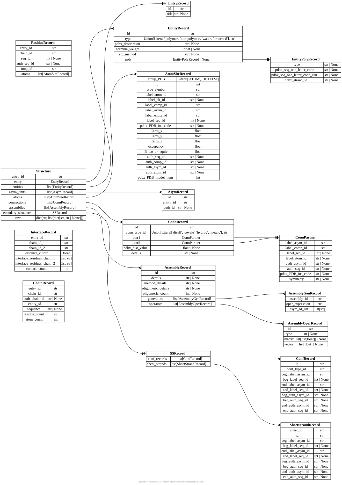
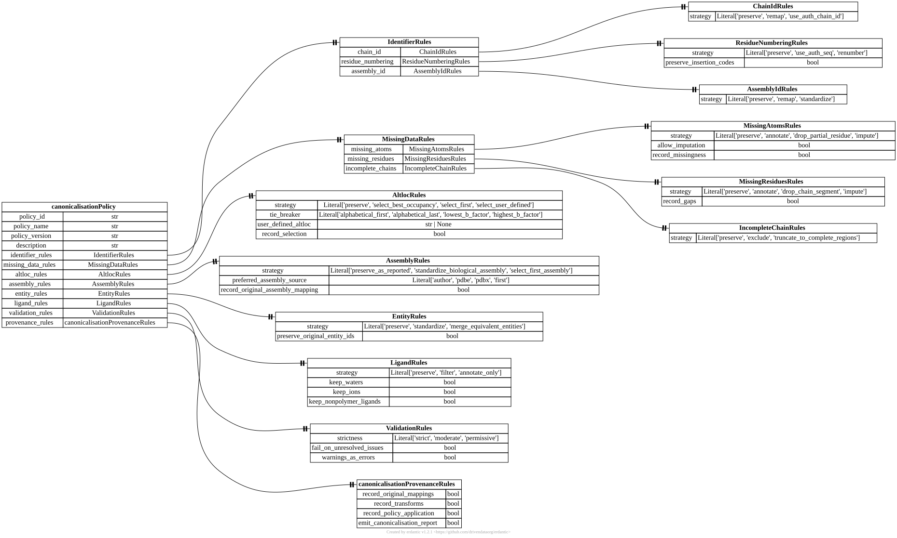
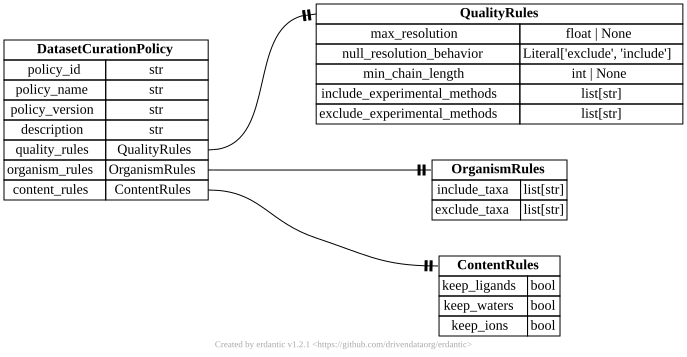
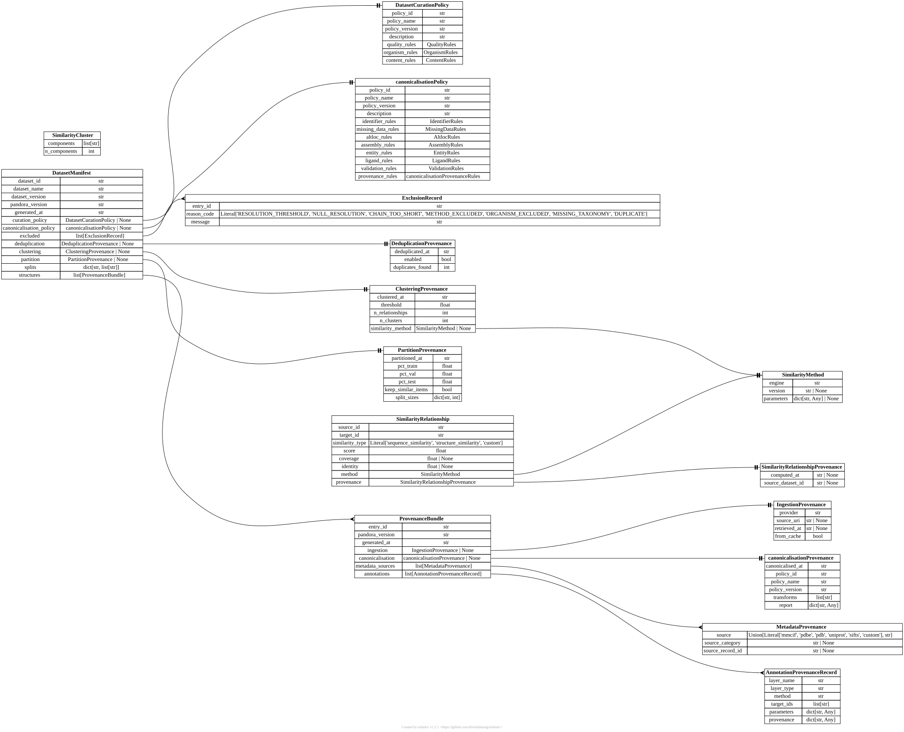

# Architecture

Pandora's pipeline (see [Home](index.md)) is a chain of plain functions, but
the *data* those functions pass around is what actually defines the
framework's shape. This page maps how the typed [Pydantic](https://docs.pydantic.dev/)
models in `pandora/schemas/` reference each other — diagrams below are
entity-relationship diagrams generated straight from the models' type hints
via [erdantic](https://erdantic.drivendata.org/), so they can never drift
from the code. Regenerate them after changing a model:

```sh
uv run --extra docs python docs/scripts/generate_erd.py
```

For per-field descriptions, see [Schemas](reference/schemas.md); for the
functions that build and consume these models, see
[Functions](reference/functions.md).

## The parsed molecule

`mmcif_to_structure()` (`pandora.parsing`) turns a raw mmCIF file into a
`Structure` — the framework's central data model. Every later stage
(`canonicalise_structure()`, `collect_metadata()`, the `annotate_*()`
functions, `structure_to_mmcif()`) takes a `Structure` in and, where it
transforms one, returns a new `Structure` rather than mutating in place.
`pandora.datasets.extract_*_records()` reshapes a canonical `Structure`
into flatter, ML-friendlier views (`ChainRecord`, `ResidueRecord`,
`InterfaceRecord`) for export.



## Canonicalisation policy

`canonicalise_structure()` runs nine rule groups in a fixed order — chain
IDs, residue numbering, assemblies, entities, missing data, altlocs,
ligands, then validation — each configured by one rules sub-model bundled
into a single `canonicalisationPolicy`. This tree is exactly what a
policy YAML file (`docs/policies.md`) deserializes into.



## Dataset curation policy

`curate_structure()` filters a canonical `Structure` by quality
(resolution, experimental method, chain length), source organism, and
non-polymer content — governed by a much smaller `DatasetCurationPolicy`.



## Provenance and the dataset manifest

Every stage produces its own provenance record; `build_provenance_bundle()`
collects one structure's worth (`ProvenanceBundle`) and
`build_dataset_manifest()` aggregates dataset-wide provenance —
curation, deduplication, clustering, partitioning — plus every retained
structure's bundle into one `DatasetManifest`, the single JSON file that
`reproduce_dataset()` can later replay from. The `canonicalisationPolicy`
and `DatasetCurationPolicy` boxes below are the same models diagrammed
above, shown collapsed here to keep this diagram readable.



## Standalone models

A few models aren't pictured because they don't reference — or get
referenced by — any other schema:

- **`AnnotationLayer`** (`pandora.schemas.annotation`) is the live result
  returned by each `annotate_*()` function; only its lighter-weight
  sibling `AnnotationProvenanceRecord` (pictured above, under
  `ProvenanceBundle`) gets persisted into a manifest.
- **`Diagnostic`/`DiagnosticBundle`** (`pandora.schemas.common`) carry
  parsing/canonicalisation warnings and errors; they're threaded through
  as function arguments, not stored on any other model.
- **`FetchOptions`** (`pandora.schemas.ingestion`) configures one
  `fetch_mmcif()` call and isn't retained afterward — only its result,
  `IngestionProvenance`, is.

## Where the gaps are

This is also the fastest way to spot missing wiring — e.g. the
[design-doc caveat in CLAUDE.md](https://github.com/npechl/pandora/blob/main/CLAUDE.md)
notes there's still no `PandoraArtifact`/dataset-store system; on this page
that shows up as `DatasetManifest` having no model that embeds actual
structure *content* (mmCIF bytes, coordinates) — only ids, policies, and
provenance. If you're looking for a contribution, tracing a diagram back to
its building function (via [Functions](reference/functions.md)) is a quick
way to find a stage whose output model is thinner than it could be.
