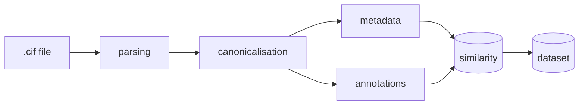

# Pandora

Pandora turns raw PDB/PDBe mmCIF files into typed, policy-driven,
ML-ready protein structure datasets.

!!! warning "Status"
    Pandora is under active development. Ingestion, parsing,
    canonicalisation, metadata, annotations, export, and a
    per-structure provenance bundle are implemented today. Dataset
    curation and the CLI are still stubs on the roadmap.

Every stage is a plain function: pass a `Structure` (or a typed record)
in, get one out. Nothing is hidden behind a framework object or global
state, so you can call one stage on its own or chain all of them into a
pipeline.

<!-- ## The pipeline



Each box is one importable function — `mmcif_to_structure()`,
`canonicalise_structure()`, `collect_metadata()`, `annotate_*()` — that
you call directly. There's no pipeline object to configure; you write
the loop yourself and call as many or as few stages as you need. -->

## Install

Not yet on PyPI — install from source:

```bash
git clone https://github.com/npechl/pandora.git
cd pandora

# Base install
pip install -e .
```

See [Installation](getting-started/installation.md) for what each optional extra
(`ingestion`, `export`, `similarity`, ...) unlocks.

## Where to go next

- **New here?** Start with [Getting Started](getting-started/getting-started.md) — a
  five-minute, fully offline walkthrough using the bundled sample data.
- **Configuring canonicalisation?** [Policies](policies.md) covers
  every policy field.
- **Looking for a specific function?** The [Functions](reference/functions.md)
  and [Schemas](reference/schemas.md) references are generated straight from
  the docstrings.
